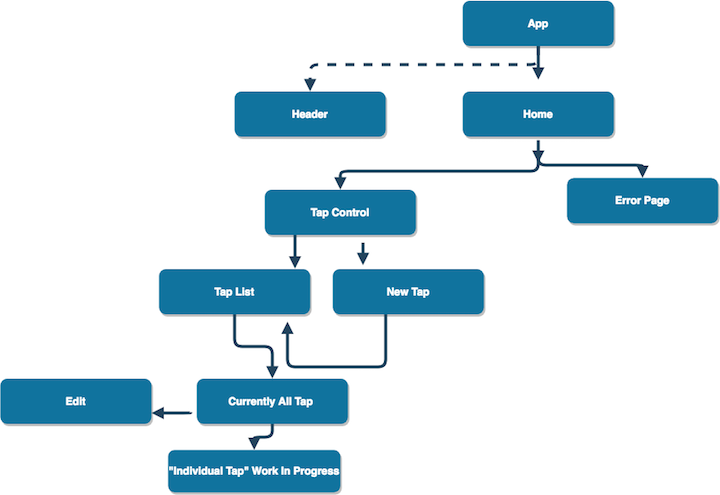

# Tap Room Makeover
# By Brian Palowski

This Application currently is set up with routes to a Home/Tap List/Error Component. This is also a recreation of our Tap Room Project .

# Check out what I have so far with my Component Route Structure

# Tools
Javascript
CSS
HTML
react

#Installation
Clone from https://github.com/bpalowski/React-Project-Week-1
npm Install
webpack
npm init
npm start run

#Command for Esling
npm run lint
npm run lint--fix
